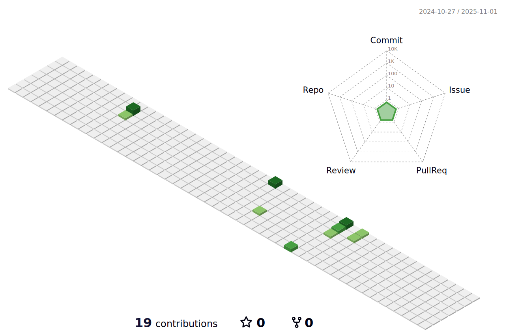

<h1 align="center">Hi 👋, I'm Mariam Khan</h1>
<h3 align="center">A product designer & developer based in Canada.</h3>

- 🔭 I’m currently working on **Trailblazer**

- 🌱 I’m currently learning **React.js, Tailwind CSS**

- 👨‍💻 All of my projects are available at [mariamkhan.dev](mariamkhan.dev)

- 📫 How to reach me **mariamf.khan@outlook.com**

<h3 align="left">Connect with me:</h3>

<h3 align="left">Languages and Tools:</h3>

                   

<!-- Code To Render Snake GIF -->

  <h2>🐍 My Contributions 🐍</h2>
  
  <picture>
    <source media="(prefers-color-scheme: dark)" srcset="https://raw.githubusercontent.com/mariviadev/mariviadev/output/github-contribution-grid-snake-dark.svg" />
    <source media="(prefers-color-scheme: light)" srcset="https://raw.githubusercontent.com/mariviadev/mariviadev/output/github-contribution-grid-snake.svg" />
    
  </picture>
  
    

<!-- Code To Render 3D Commit Table -->
<picture>
  <source media="(prefers-color-scheme: dark)" srcset="./profile-3d-contrib/profile-night-green.svg" />
  <source media="(prefers-color-scheme: light)" srcset="./profile-3d-contrib/profile-green-animate.svg" />
  
</picture>
  
